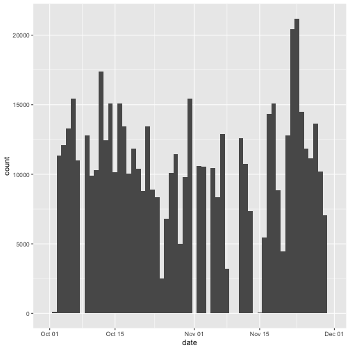
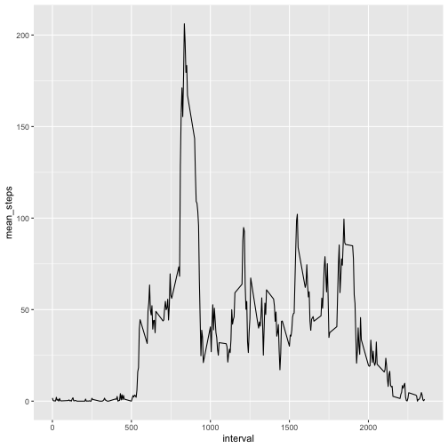
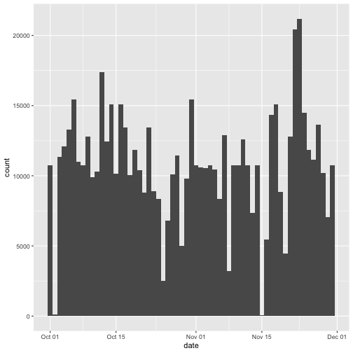
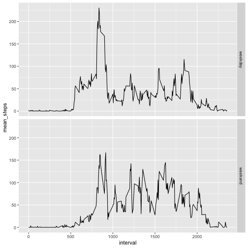

```r
#Read in the data directly 
df <- read.csv(unz("/Users/Ellie/Documents/Personal_development/Data_sciences_training/Coursera_data_science/github/RepData_PeerAssessment1/activity.zip","activity.csv"))
```


```r
df <- setDT(df)
#Calculate the total steps
df1 <- df[, total_step := sum(steps), by=date]
df2 <- unique(df1[, list(date, total_step)])
df2$date <- as.Date(df2$date)

a <- ggplot(df2) + geom_histogram(aes(x=date, weight=total_step),bins = 61) + scale_x_date()
a
```



```r
#Compute mean and median
df1 <- df1[, mean_step := mean(steps,na.rm = TRUE), by=date]
#Data.table does not work for median somehow, use dplyr
df1 <- as_tibble(df1)
df1<- group_by(df1, date)
df1<- setDT(mutate(df1, median_step = median(steps,na.rm = TRUE)))

df3 <- unique(df1[, list(date, mean_step, median_step)])
#Report as a table
pander(df3,caption = "Mean and median of steps per each day")
```


--------------------------------------
    date      mean_step   median_step 
------------ ----------- -------------
 2012-10-01      NA           NA      

 2012-10-02    0.4375          0      

 2012-10-03     39.42          0      

 2012-10-04     42.07          0      

 2012-10-05     46.16          0      

 2012-10-06     53.54          0      

 2012-10-07     38.25          0      

 2012-10-08      NA           NA      

 2012-10-09     44.48          0      

 2012-10-10     34.38          0      

 2012-10-11     35.78          0      

 2012-10-12     60.35          0      

 2012-10-13     43.15          0      

 2012-10-14     52.42          0      

 2012-10-15     35.2           0      

 2012-10-16     52.38          0      

 2012-10-17     46.71          0      

 2012-10-18     34.92          0      

 2012-10-19     41.07          0      

 2012-10-20     36.09          0      

 2012-10-21     30.63          0      

 2012-10-22     46.74          0      

 2012-10-23     30.97          0      

 2012-10-24     29.01          0      

 2012-10-25     8.653          0      

 2012-10-26     23.53          0      

 2012-10-27     35.14          0      

 2012-10-28     39.78          0      

 2012-10-29     17.42          0      

 2012-10-30     34.09          0      

 2012-10-31     53.52          0      

 2012-11-01      NA           NA      

 2012-11-02     36.81          0      

 2012-11-03     36.7           0      

 2012-11-04      NA           NA      

 2012-11-05     36.25          0      

 2012-11-06     28.94          0      

 2012-11-07     44.73          0      

 2012-11-08     11.18          0      

 2012-11-09      NA           NA      

 2012-11-10      NA           NA      

 2012-11-11     43.78          0      

 2012-11-12     37.38          0      

 2012-11-13     25.47          0      

 2012-11-14      NA           NA      

 2012-11-15    0.1424          0      

 2012-11-16     18.89          0      

 2012-11-17     49.79          0      

 2012-11-18     52.47          0      

 2012-11-19     30.7           0      

 2012-11-20     15.53          0      

 2012-11-21     44.4           0      

 2012-11-22     70.93          0      

 2012-11-23     73.59          0      

 2012-11-24     50.27          0      

 2012-11-25     41.09          0      

 2012-11-26     38.76          0      

 2012-11-27     47.38          0      

 2012-11-28     35.36          0      

 2012-11-29     24.47          0      

 2012-11-30      NA           NA      
--------------------------------------

Table: Mean and median of steps per each day


```r
df1<- group_by(df1, interval)
df1<- setDT(mutate(df1, mean_step2 = mean(steps,na.rm = TRUE)))
df4 <- unique(df1[, list(interval, mean_step2)])

b <- ggplot(data = df4, aes(x=interval, y=mean_step2))+geom_line()+ylab("mean_steps")
b
```



```r
df4 <- df4[order(mean_step2, decreasing = TRUE),]
pander(df4[1,], caption = "Interval with the max value of mean steps")
```


-----------------------
 interval   mean_step2 
---------- ------------
   835        206.2    
-----------------------

Table: Interval with the max value of mean steps


```r
#Impute 0 with mean value of that interval because there are all NAs on some dates
df5 <- df1[, replace_steps := ifelse(is.na(steps), mean_step2, steps)]
df5 <- df5[, list(date, interval, replace_steps)]

#For the new dataset
#Calculate the total steps
df6 <- df5[, total_step := sum(replace_steps), by=date]
df7 <- unique(df6[, list(date, total_step)])
df7$date <- as.Date(df7$date)

c <- ggplot(df7) + geom_histogram(aes(x=date, weight=total_step),bins = 61) + scale_x_date()
c
```



```r
#Compute mean and median
df6 <- df6[, mean_step := mean(replace_steps,na.rm = TRUE), by=date]
#Data.table does not work for median somehow, use dplyr
df6 <- as_tibble(df6)
df6<- group_by(df6, date)
df6<- setDT(mutate(df6, median_step = median(replace_steps,na.rm = TRUE)))

df7 <- unique(df6[, list(date, mean_step, median_step)])
#Report as a table
pander(df7,caption = "Mean and median of steps per each day (imputed data)")
```


--------------------------------------
    date      mean_step   median_step 
------------ ----------- -------------
 2012-10-01     37.38        34.11    

 2012-10-02    0.4375          0      

 2012-10-03     39.42          0      

 2012-10-04     42.07          0      

 2012-10-05     46.16          0      

 2012-10-06     53.54          0      

 2012-10-07     38.25          0      

 2012-10-08     37.38        34.11    

 2012-10-09     44.48          0      

 2012-10-10     34.38          0      

 2012-10-11     35.78          0      

 2012-10-12     60.35          0      

 2012-10-13     43.15          0      

 2012-10-14     52.42          0      

 2012-10-15     35.2           0      

 2012-10-16     52.38          0      

 2012-10-17     46.71          0      

 2012-10-18     34.92          0      

 2012-10-19     41.07          0      

 2012-10-20     36.09          0      

 2012-10-21     30.63          0      

 2012-10-22     46.74          0      

 2012-10-23     30.97          0      

 2012-10-24     29.01          0      

 2012-10-25     8.653          0      

 2012-10-26     23.53          0      

 2012-10-27     35.14          0      

 2012-10-28     39.78          0      

 2012-10-29     17.42          0      

 2012-10-30     34.09          0      

 2012-10-31     53.52          0      

 2012-11-01     37.38        34.11    

 2012-11-02     36.81          0      

 2012-11-03     36.7           0      

 2012-11-04     37.38        34.11    

 2012-11-05     36.25          0      

 2012-11-06     28.94          0      

 2012-11-07     44.73          0      

 2012-11-08     11.18          0      

 2012-11-09     37.38        34.11    

 2012-11-10     37.38        34.11    

 2012-11-11     43.78          0      

 2012-11-12     37.38          0      

 2012-11-13     25.47          0      

 2012-11-14     37.38        34.11    

 2012-11-15    0.1424          0      

 2012-11-16     18.89          0      

 2012-11-17     49.79          0      

 2012-11-18     52.47          0      

 2012-11-19     30.7           0      

 2012-11-20     15.53          0      

 2012-11-21     44.4           0      

 2012-11-22     70.93          0      

 2012-11-23     73.59          0      

 2012-11-24     50.27          0      

 2012-11-25     41.09          0      

 2012-11-26     38.76          0      

 2012-11-27     47.38          0      

 2012-11-28     35.36          0      

 2012-11-29     24.47          0      

 2012-11-30     37.38        34.11    
--------------------------------------

Table: Mean and median of steps per each day (imputed data)

- There are 6912 NAs in the original dataset. 

- Imputing zero did not change the mean, median or total daily steps dramatically. 


```r
df5$date <- as.Date(df5$date)
df5 <- df5[, wd := weekdays(date)]
df5 <- df5[,days := ifelse(wd %in% c("Sunday","Saturday"), "weekend", "weekday")]

df5<- group_by(df5, interval,days)
df5<- setDT(mutate(df5, mean_step3 = mean(replace_steps,na.rm = TRUE)))
df8 <- unique(df5[, list(interval, mean_step3, days)])

d <- ggplot(data = df8, aes(x=interval, y=mean_step3))+geom_line()+ylab("mean_steps")+facet_grid(days ~.)
d
```




